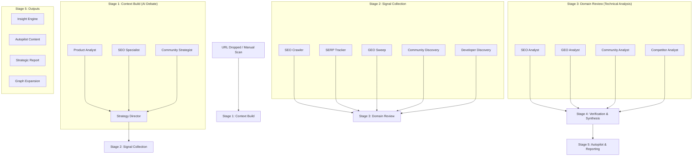
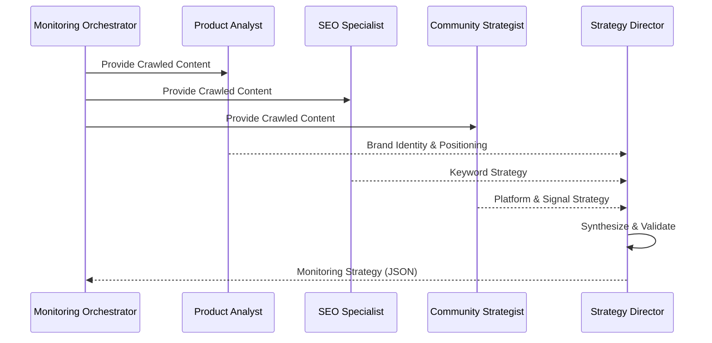
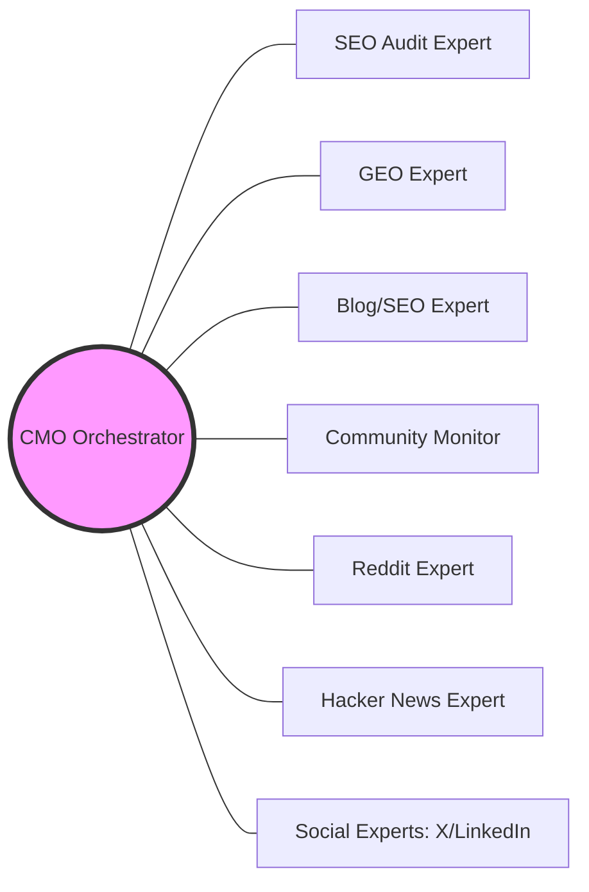
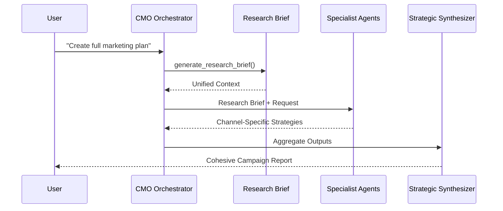

# AI-CMO Agent Orchestration

This document describes exactly what happens in the AI-CMO system from the moment a URL is dropped until actionable marketing strategies and content are produced.

## 1. The URL Ingestion Pipeline (Automatic Scan)

When a project is created or a manual scan is triggered, the **Monitoring Orchestrator** executes a multi-stage pipeline.

### Stage 1: Context Build (3-Role AI Debate)
The system doesn't just "read" the page; it interprets it through a competitive debate between three specialist roles:

- **Product Analyst**: Identifies brand identity, value proposition, target persona, and category fit.
  - *How*: Uses LLM analysis on filtered `crawl4ai` text to extract strategic positioning.
- **SEO Specialist**: Extracts brand, category, problem-led, and competitor-specific keywords.
  - *How*: Maps product features to high-intent search terms based on semantic relevance.
- **Community Strategist**: Maps out which platforms (Reddit, HN, Dev.to) and queries will capture the most signal.
  - *How*: Predicts where the target persona congregates using community-specific pattern matching.
- **Strategy Director**: Synthesizes the debate into a validated monitoring strategy (JSON).
  - *How*: Acts as a quality gate to consolidate the debate into a structured, machine-readable JSON config.

### Stage 2: Signal Collection
Specialized tools run in parallel to gather raw evidence:
- **SEO Crawler**: Performs technical audits and captures Core Web Vitals (LCP, CLS, TBT).
  - *How*: `crawl4ai` (Playwright) parses DOM structure while `Google PageSpeed Insights API` fetches metrics.
- **SERP Tracker**: Checks real-time rankings for all identified keywords across major search engines.
  - *How*: Uses `Tavily` or Google scrape fallbacks to locate the brand's URL in the top 100 search results.
- **GEO Sweep**: Queries AI search engines to compute an "AI Visibility Score" (GEO Score).
  - *How*: Aggregates results from `Perplexity`, `Tavily`, and `OpenAI` APIs to measure mention frequency and sentiment.
- **Community Discovery**: Scans platforms for existing brand mentions or relevant discussions.
  - *How*: Executes targeted queries across `Reddit`, `Hacker News`, and `Dev.to` via specialized community providers.
- **Developer Discovery**: Scans GitHub for developer signals and contactable contributors.
  - *How*: Uses `GitHub API` to find repos related to the product and identify active developers/maintainers.

### Stage 3: Domain Review (Technical Analysis)
Four specialist AI analysts review the normalized signals:
- **SEO Analyst**: Flags technical gaps and ranking risks.
  - *How*: Evaluates SEO snapshots against health thresholds (score < 50) and indexing coverage.
- **GEO Analyst**: Identifies "AI blind spots" where the brand is absent from LLM retrieval.
  - *How*: Analyzes platform-specific visibility percentages and suggests citability improvements.
- **Community Analyst**: Surfaces high-value engagement opportunities.
  - *How*: Scores discussions by engagement (comments, upvotes) and relevancy to prioritize replies.
- **Competitor Analyst**: Analyzes keyword overlap and differentiation gaps.
  - *How*: Compares project keywords against competitor keyword sets stored in the SQLite database.

### Stage 4: Verification & Synthesis
- **Chief Verifier**: Validates findings, deduplicates overlap, and classifies evidence quality.
  - *How*: Runs a `FindingVerifier` suite that filters conflicts and upgrades evidence refs to a strict schema.
- **Strategy Synthesizer**: Collates everything into a coherent summary of findings and recommended actions.
  - *How*: Aggregates validated findings and deduplicated recommendations into a final strategic readout.

### Stage 5: Autopilot & Reporting
- **Insight Engine**: Rule-based detection of immediate opportunities.
  - *How*: Matches scan snapshots against hardcoded heuristics (e.g., missing robots.txt or high-engagement Reddit threads).
- **Autopilot**: Automatically generates content for high-signal community threads.
  - *How*: Uses `execute_autopilot` to match insights to content templates and populate the approval queue.
- **Strategic Reporter**: Generates a deep, 10+ page marketing report.
  - *How*: Triggers the `report_pipeline.py` which executes a multi-agent writing workflow with multi-round refinement.
- **Graph Expansion**: Triggers a background process to expand the competitive intelligence graph.
  - *How*: Enqueues a `graph_expansion` worker task to discover and link new competitors and keywords.

---

## 2. Our Specialist Agents

When you interact with the system via chat, the **CMO Agent** orchestrates several specialist experts.

| Agent | Expertise | Primary Tools / Method |
|-------|-----------|------------------------|
| **CMO Orchestrator** | Strategy leader, routes requests, coordinates multi-channel campaigns. | Uses `Agent` handoff logic and `generate_research_brief` tool for orchestration. |
| **SEO Audit Expert** | Technical SEO, Core Web Vitals, `llms.txt` generation, and index coverage. | Calls `audit_page_seo` (custom parser) and `generate_llmstxt` (standard validator). |
| **AI Visibility (GEO) Expert** | Improving brand presence in AI search engines and computing GEO scores. | Executes `check_visibility_multi` across Perplexity, Tavily, and OpenAI providers. |
| **Blog/SEO Expert** | Generates 2000+ word articles, outlines, and long-form SEO strategy. | Uses `blog_writer.py` to research via `web_search` and synthesize long-form content. |
| **Community Monitor** | Reddit/HN/Dev.to engagement. Drafts authentic, non-spammy replies. | Scans `community_providers.py` and uses `draft_community_reply` with text relevancy scoring. |
| **Trend Specialist** | Researches trending topics and platform-specific "what's hot" signals. | Uses `trend_research.py` to aggregate social signals and topic clusters. |
| **Reddit Expert** | Authentic community-specific posts for r/SideProject and niche subs. | Crafts subreddit-aware markdown posts using niche-specific prompt contracts. |
| **Twitter/X Expert** | Viral-ready tweets and multi-post threads. | Generates high-engagement tweet chains based on campaign research briefs. |
| **LinkedIn Expert** | Professional B2B posts, long-form and short-form variants. | Produces authority-focused professional content with variant testing. |
| **Hacker News Expert** | Show HN posts optimized for developer interest and authenticity. | Drafts technical Show HN submissions with focus on engineering transparency. |

---

## 3. Key Orchestration Workflows

### Multi-Channel Orchestration
When you ask for a "full marketing plan," the CMO:

1.  Runs `generate_research_brief` to create a unified context document (Brand, Audience, Pain, Promise, Proof).
2.  Passes this brief to multiple specialists simultaneously.
3.  Synthesizes their individual outputs into a cohesive campaign report.

### Deep Handoffs
For single-channel requests (e.g., "Write me a thread about X"), the CMO performs a **Handoff**. The specialist agent takes control of the conversation for deep, iterative refinement of the content.

### Graph Intelligence
The system maintains a competitive knowledge graph.
- **How**: SQLite stores nodes (projects, keywords, competitors) and edges (rankings, mentions).
- **Orchestration**: Agents use the `get_competitive_landscape` tool to query the graph, identifying keyword overlaps, SERP gaps, and direct competitor moves.
