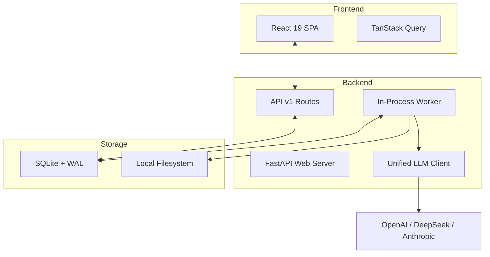
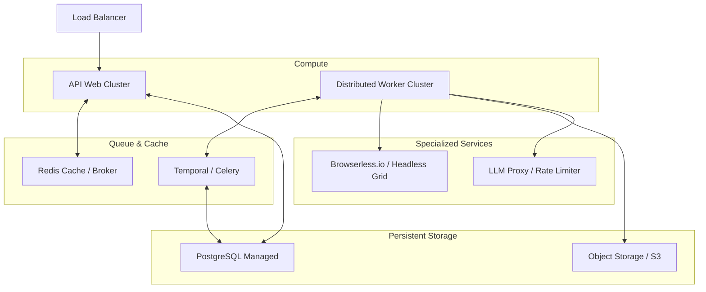

<div align="center">
  
</div>

<h1 align="center">AI-CMO</h1>

<p align="center">
  <strong>AI-CMO is an open-source growth system that unifies SEO, GEO, SERP, and community monitoring.</strong><br/>
  <sub>Built for open-source projects and developer products. See where your project is discovered, discussed, and compared — then turn those signals into reports, briefs, approvals, and actions.</sub>
</p>

<div align="center">
  <a href="README.md">English</a> | <a href="README_zh.md">中文</a> | <a href="README_ja.md">日本語</a> | <a href="README_ko.md">한국어</a> | <a href="README_es.md">Español</a>
</div>

<p align="center">
  <a href="https://www.python.org/downloads/"></a>
  <a href="LICENSE"></a>
  <a href="https://github.com/study8677/AI-CMO/stargazers"></a>
  
</p>


---

## 📖 Documentation

- **[Agent Orchestration Guide](AGENT_ORCHESTRATION.md)** — Learn how the 6-stage pipeline works and meet our specialist agents.

---

## 🏗️ System Design

AI-CMO is built as a modular monolithic application designed for rapid iteration and high observability.

### Current Architecture



#### Core Components
- **FastAPI Core**: Handles RESTful API requests, SSE (Server-Sent Events) for real-time progress, and BYOK (Bring Your Own Key) middleware.
- **In-Process Worker**: A task execution engine that polls the `background_tasks` table. It manages concurrency using `asyncio.Semaphore` and handles task recovery on startup.
- **6-Stage Monitoring Pipeline**:
    1. **Context Build**: Multi-agent debate (Product, SEO, Community) to extract brand DNA.
    2. **Signal Collect**: Parallel scanning of SEO, GEO (AI Search), Community (Reddit/HN), and SERP.
    3. **Normalize**: Deduplication and standardization of cross-platform signals.
    4. **Domain Review**: Independent AI analysis for each marketing vertical.
    5. **Strategy Synthesis**: Strategic Director agent synthesizes findings into actions.
    6. **Persist & Publish**: Final results saved to DB and reports generated.
- **Unified LLM Client**: Centralized client in `llm.py` providing automatic retries, exponential backoff, and strict ContextVar isolation for API keys.

---

## 🚀 Scaling to 100k DAU

The current design is optimized for single-node deployment and low-to-medium usage. To handle **100,000 Daily Active Users**, we must address several architectural bottlenecks.

### 🔍 Current Gaps & Bottlenecks
1. **SQLite Contention**: While WAL mode helps, SQLite's single-writer model will cause significant latency under high concurrent writes from thousands of users and workers.
2. **In-Process Workers**: Background tasks (especially crawls) share CPU and Memory with the web server. A spike in scans can crash the entire API service.
3. **Headless Browser Overhead**: Running Playwright/Crawl4AI locally is resource-intensive. Scaling this linearly on one machine is impossible.
4. **State Isolation**: The current system lacks a distributed cache (like Redis). State is tied to local memory or a local file, making horizontal scaling difficult.
5. **Artifact Persistence**: Reports and lead data are stored on the local disk, which is not suitable for multi-instance cloud deployments.

### 🛠️ Proposed High-Scale Architecture

To reach 100k DAU, AI-CMO would move to a **Distributed Micro-Worker Architecture**.



#### Key Changes for Scale:
1. **Database Migration**: Move from SQLite to a managed **PostgreSQL** instance (e.g., RDS, Supabase) to handle high-concurrency connections and complex relational queries.
2. **Distributed Task Queue**: Replace the internal polling worker with **Temporal** or **Celery + Redis**. This allows workers to run on dedicated, auto-scaling nodes.
3. **Headless Browser Fleet**: Offload all crawling work to a dedicated fleet like **Browserless.io** or a Playwright Grid running in Kubernetes.
4. **Global Caching**: Use **Redis** for session management, rate limiting, and caching hot signals (e.g., SERP results) to reduce LLM and Database load.
5. **Stateless Artifacts**: Store all generated reports, PDFs, and lead data in **S3-compatible object storage**.
6. **LLM Gateway**: Implement an internal LLM proxy to handle global rate limits, token budget management, and semantic caching for common marketing queries.
7. **Observability**: Move from local logs to a centralized stack (**Prometheus/Grafana** for metrics, **ELK/Loki** for logs, and **OpenTelemetry** for tracing multi-agent pipelines).
8. **Enhanced Security**: Transition from `.env` files to a secure secrets manager (e.g., **AWS Secrets Manager** or **HashiCorp Vault**) and implement **OAuth2/OpenID Connect** for enterprise-grade user authentication.

---

## 🛠️ Getting Started (Local Development)

AI-CMO works with OpenAI-compatible APIs, including OpenAI, DeepSeek, NVIDIA NIM, and Ollama.

```bash
git clone https://github.com/study8677/AI-CMO.git
cd AI-CMO
pip install -e ".[all]"
crawl4ai-setup

cp .env.example .env
aicmo-web
```

Then open `http://localhost:8080`.

<details>
<summary>Frontend development (optional)</summary>

```bash
cd frontend
npm install
npm run dev
npm run build
```

The dev app runs at `http://localhost:5173` and proxies API traffic to `:8080`.

</details>

---

## 🤝 Roadmap & Community

- [x] AI CMO strategic scan
- [x] Multi-agent deep report pipeline (6-phase)
- [x] 3D knowledge graph & Approval queue
- [x] Full i18n support (EN/ZH/JA/KO/ES)
- [ ] Distributed worker support (Celery/Temporal)
- [ ] Enterprise SEO deeper crawls
- [ ] Brand voice controls

For the full list of contributors and more details, see [CONTRIBUTORS.md](CONTRIBUTORS.md).

---

## 📜 License
Apache 2.0 License. See [LICENSE](LICENSE) for details.
